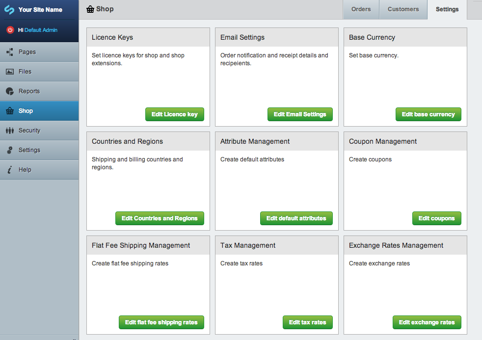
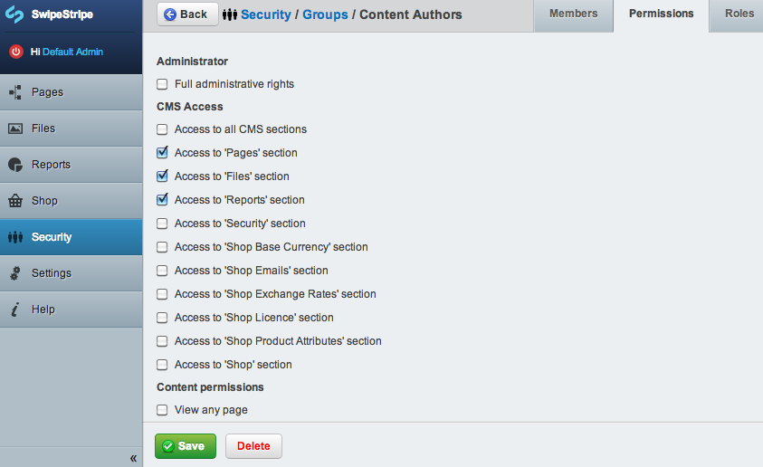

# Admin

SwipeStripe has a central area for managing orders, customers and shop settings. You can manage products from the site tree.  

When SwipeStripe extensions are installed they will often add a section to the shop settings area for configuring the extension.

## Hiding settings sections
You might like to hide settings sections from your users to prevent them making changes to the shop configuration.

Each section for settings has permissions attached, so you can easily hide a section from a group of users using permissions in the SilverStripe security area.  

If you would like to hide some settings from administrators (which by default have access to everything in the CMS) you can do so programmatically from your _config.php file.

This will hide the licence key and base currency sections - you would probably enter the licence key and base currency then hide these sections so that other admin users cannot change the base currency etc.

:::php
	ShopAdmin::$hidden_sections = array(
		'ShopAdmin_LicenceKeyAdmin',
		'ShopAdmin_BaseCurrency',
	);
