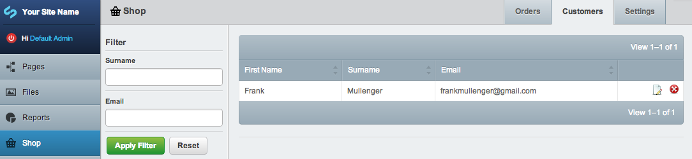
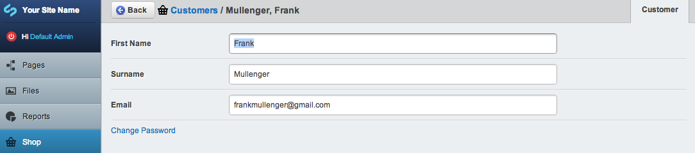

# Customers

Customers are created whenever an order is made. A customer usually has a first and last name, email address and password.

Customers are just an extension of Members so they can be managed from the Security area in the CMS if necessary. But it is usually preferable to manage customers from the Shop admin area, this area has been designed to be simple and focused on editing customer accounts only.

You can search for customers by surname or email address.

Editing customers is just as easy.

All customers are part of the "customers" security group. When a customer logs in they are automatically directed to their account page. 

In order to process orders you need to be logged in as a customer  
(not an admin).

