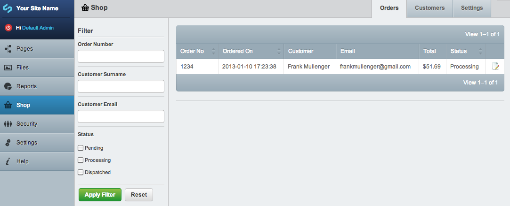
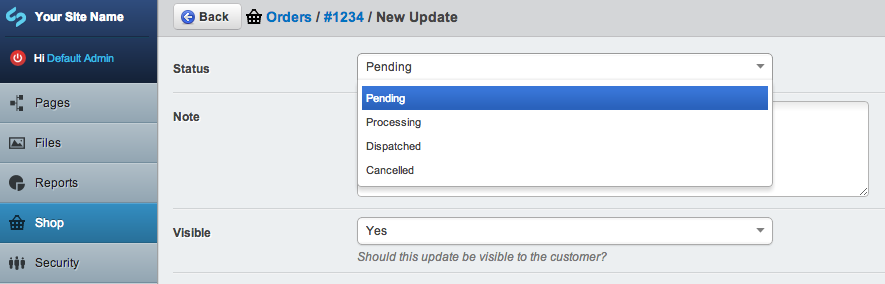

# Orders

In SwipeStripe an order is created as soon as a customer adds an item to their cart (in fact cart and order are synonymous). Once an order is completed by a customer it becomes available for you to manage in the shop admin area.

You can filter orders by order number, customer surname, customer email or order status:

## Order Updates
Orders updates are used to change the status of the order as it is processed. 

By default an order status can be one of:  
Pending  
Processing  
Dispatched  
Cancelled

Order updates can also contain notes which are either private and for internal use only, or public and can be viewed by the customer.

Order updates can be extended just like any other SilverStripe data object so you could in fact send a notification email when a new update is created, or add fields to updates such as courier codes for packages etc.
