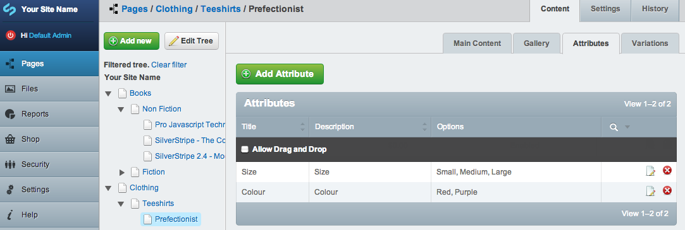
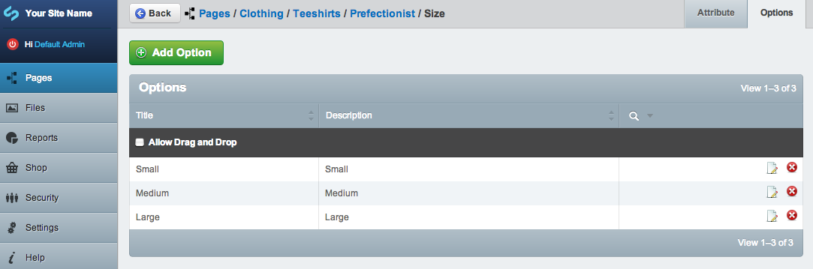
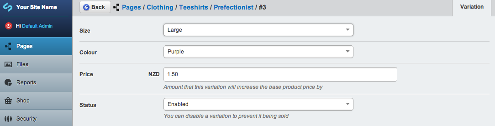

# Product Variations

## What are product variations?
Product variations are one of the more complicated concepts on SwipeStripe. Variations are what you will use if you have products like tee shirts that may come in different sizes and colours.

A product variation might represent a large, blue teeshirt for instance. You might have another variation to represent a medium, blue teeshirt, or a medium, red teeshirt.

You might **not** have a variation to represent a large, red teeshirt however if you do not sell that particular size and colour.

We can represent the variations in a simple matrix:

| &nbsp; | Size | Colour |
| ------ | -----| ------ |
|  Variation 1  |  Medium  |   Blue  |
|  Variation 2  |  Medium  |   Red  |
|  Variation 3  |  Large  |   Blue  |

Here is a similar matrix for a demo product:  

### Product Attributes
In the above example the product attributes are:  
Size  
Colour

You can add as many attributes to a product as you like. Each attribute will have a dropdown field on the product page so that customers can select the option they want for each attribute.

If a product has attributes it **MUST** have variations.

### Product Options
Each attribute has a set of available product options, you can add as many product options to each attribute as you like. 

In the above example the attribute Size has the options:   
Medium  
Large 

The attribute Colour has the options:  
Red  
Blue

### Why do we need product variations?
Product variations allow you to have control over what products you actually sell. 

In the example above a possible variation of: Large, Red, is ommitted because we do not have any large, red teeshirts for sale.

Using variations we can control what products are for sale and restrict the options presented to customers accordingly.

## Creating Product Variations

### Create Attributes and Options
When editing a product you first create product attributes - as many as you need, named however you like. In the below example Size and Colour are used.

To create an attribute all you really need is the name.

Then create options that are available for that attribute.

### Create the Variations
After creating the attributes and options available for a product it is just a matter of creating the variation itself. Each variation just needs to specify an option for every attribute on the product.

You can also specify a price that the variation is going to increase the base product price by, for instance if a variation has a price of $1.50 and the base product price is $30.00 when the options matching that variation are chosen by a customer the product price will increase to $31.50 automatically.

Each variation **MUST** have a valid option for every attribute assigned to a product. This means if you create variations for a product then add more attributes to the product the variations will be **disabled** until you edit them and set an option on each variation for the newly added attribute.  

This prevents customers from purchasing incomplete variations - products that do not exist.

 
