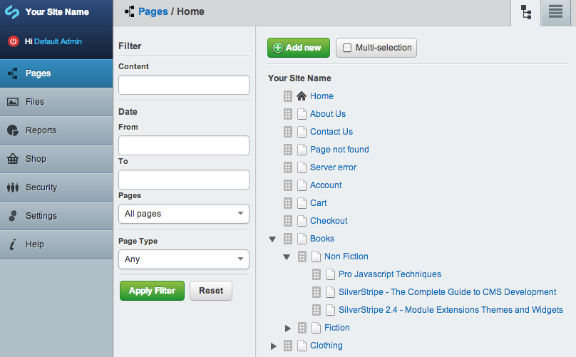
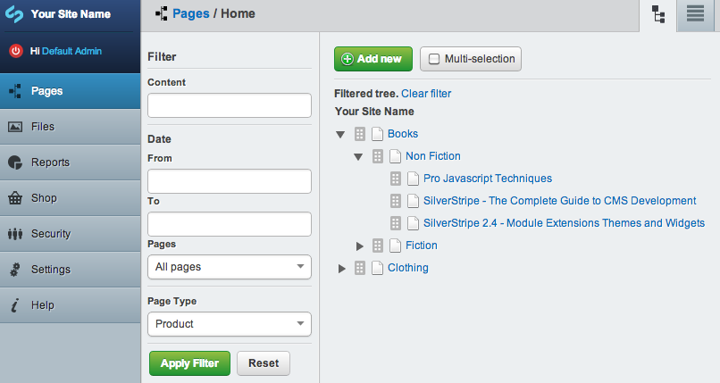
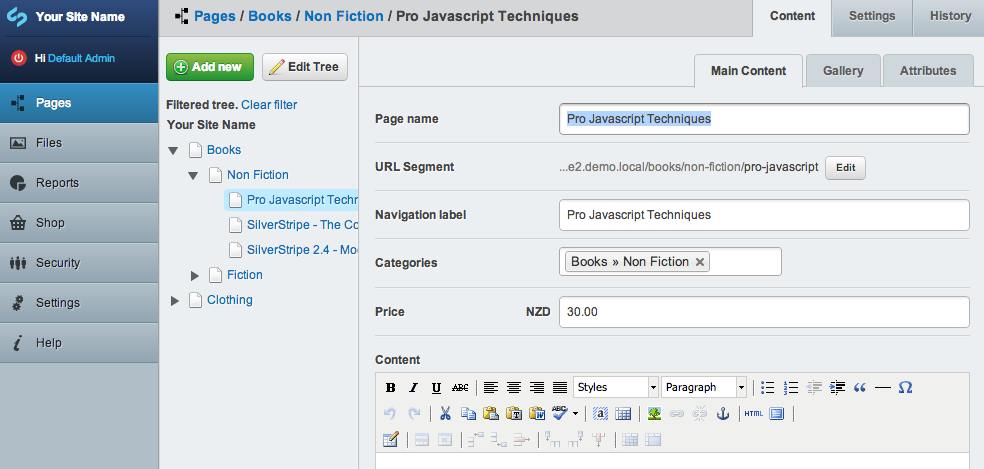
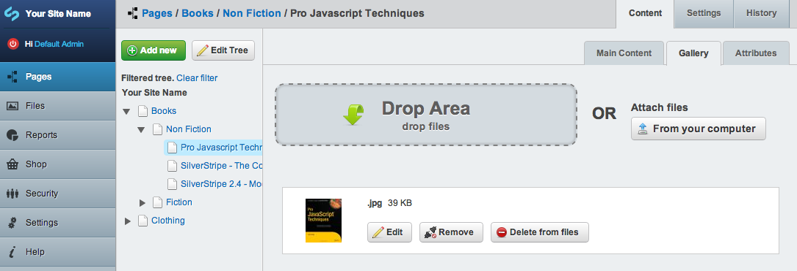

# Products

## Editing
Products are essentially just pages with a few extra fields attached. You manage products from the site tree just as you would any other page in the CMS. 

If you have a lot of products on your site you can use the site tree filters to generate a more manageable list.  

Editing products is really the same as editing pages, all you really need to do is add a price to a product and it is ready to sell.

Adding product images is really simple, just drag and drop images and they will be uploaded. You can then drag product images to sort them.

## Extending
The Product class simply extends Page so you can apply DataExtensions to Product to unobtrusively alter the behaviour or data of Products easily from your app. 

The Product_Controller similarly extends Page_Controller so you can do the same trick using Extensions to add actions to the Product_Controller.

Extending and decorating products should be a breeze if you are familiar with SilverStripe.
