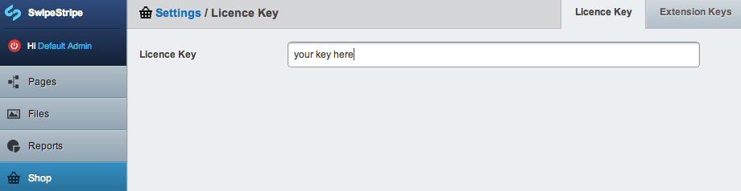
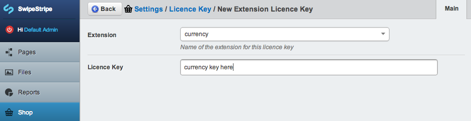
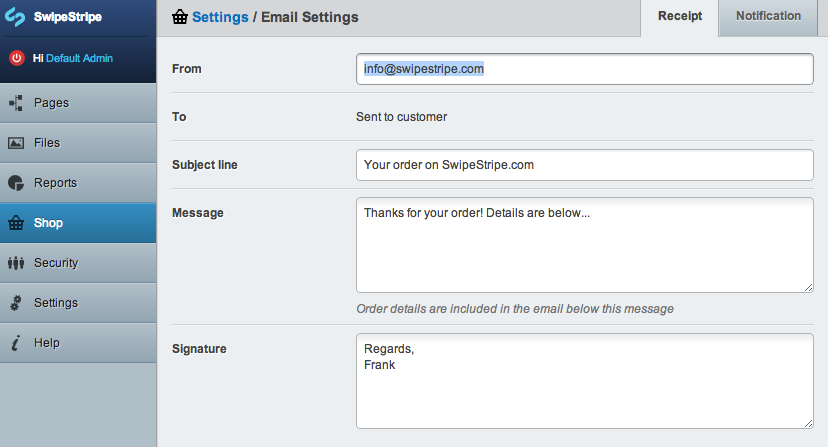
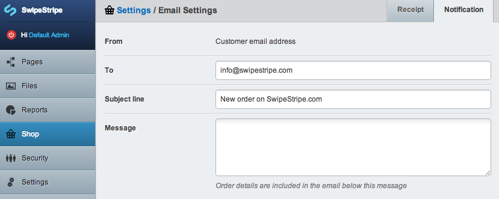
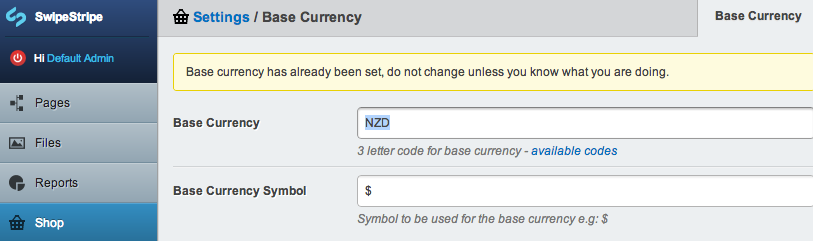

# Settings

SwipeStripe has 3 areas of basic settings that are usually required when deploying a site. The settings can be configured from the shop admin area settings tab in the CMS.

## Licence Keys 
Before deploying a site "live" you must purchase licence keys for SwipeStripe and any SwipeStripe Extensions you are using. When you purchase a licence from SwipeStripe.com you will receive a key which you can enter in this section.

If you have SwipeStripe extensions installed you will also need to install keys for each, doing so is fairly straight forward.

## Email 
When orders are placed on your shop 2 emails are sent - one to the customer (Receipt) and one to an administrator (Notification). These email notifications include a full order summary, they can be personalised slightly from the shop admin area.

Receipt is sent to the customer:  

Notification is sent to an email address of your choosing:  

## Base Currency
The base currency is the currency you will use when entering all the prices for products on your site. 

It is also the currency that is used when payment is processed via your payment gateway so it should match the currency your payment gateway is set up for. All orders are made in the base currency.

Once a base currency is set it is best not to change it! This is why it is a good idea to hide this section from users to prevent them from accidentally changing the base currency.

If you do need to change the base currency you will just need to correct the price of each product in your store. Each product stores the base currency so you will also need to publish each product after changing the base currency. I would strongly recommend against changing the base currency after you have started processing orders.

