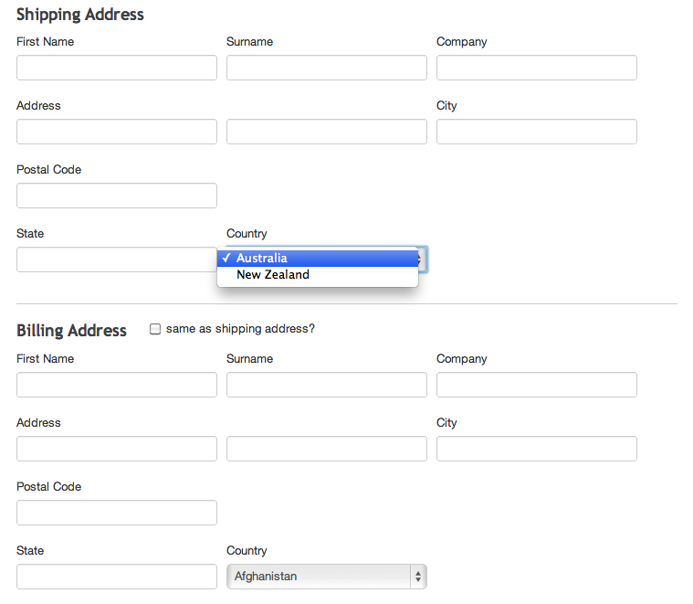
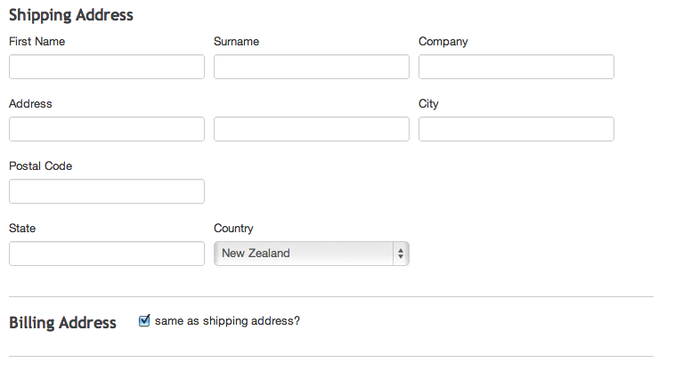

# Addresses

Shipping and billing address support has been seperated from the core SwipeStripe module into a seperate "Addresses" extension. The reason for this change is to keep SwipeStripe modular and flexible in an effort to support a wide variety of ecommerce requirements.

Ecommerce sites often gather different data from customers at the checkout stage, we have simplified the checkout form so that you can customise the form according to your needs easily.

## Countries
Shipping and billing countries can be managed from the SwipeStripe shop admin in the CMS. 

When the addresses module is installed billing countries are created for you and cover all the countries in the world. You will need to create shipping countries however.

The shipping and billing countries are then available for customers to select when they are entering their shipping and billing addresses at the checkout.

If the billing address is the same as the shipping address it will be automatically copied over.

Shipping countries must be a subset of billing countries so that when a shipping country is copied to the billing address the same billing country exists to be selected.

