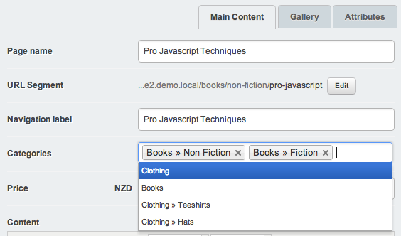

# Product Categories

SwipeStripe includes "Product" page types but not "Product Category" page types because product categories are not essential for every ecommerce website and quite often developers will want to implement their own product categories solution given that it is so easy to do so with SilverStripe.

The "Category" extension does include a "ProductCategory" page type which you can easily use to create product categories in your site tree and assign products to those categories.

## Multiple categories
Products commonly fall into more than one category, however a product can only the the child of a single product category page in the CMS site tree.

The "Category" extension skirts this issue with a many_many relation between product and product category, meaning you can have a product appear once in the site tree but also assign it to other product categories in the site tree easily.

## Frontend

Because the product only appears once in the site tree it can only be accessed by a single unique URL - which is a feature often important for Search Engine Optimisation (SEO).

Product categories will grab all products in the subtree - all products in the current category as well as in the child categories of the current category. 

Pagination is included and will be generated automatically. Pagination defaults to displaying 12 products per page however this can be configured easily from your _config.php.

:::php
	ProductCategory_Controller::$products_per_page = 9;
	
The templates use CSS that assumes that the number of products displayed per page is a multiple of 3, you can easily override the template (swipestripe-category/templates/Includes/Products.ss) by copying it to your themes folder.

