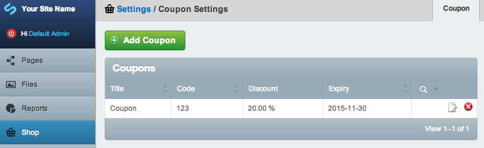
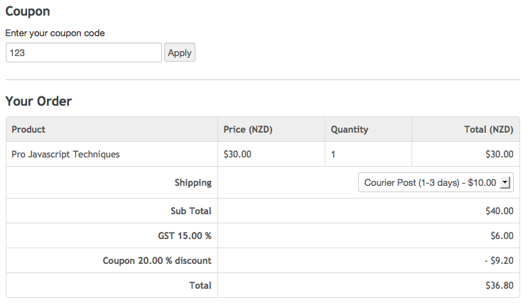

# Coupons

Coupons are a great way of offering discounts to certain customers. Coupons can be managed in the SwipeStripe shop settings area of the CMS and redeemed at the checkout by the customer.

## Setting Coupons
You can easily generate coupon codes in the admin area with an associated discount and expiry.

## Redeeming codes
Customers just need to enter the coupon code at the checkout and click on "Apply".

The order is instantly updated, if the coupon is valid and has not expired a discount is applied to the value of the entire order (including the tax component).

