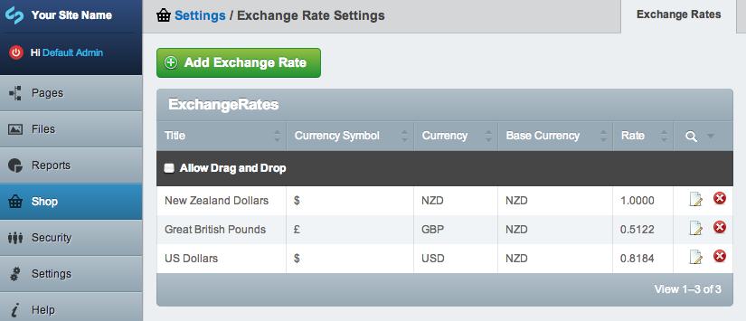
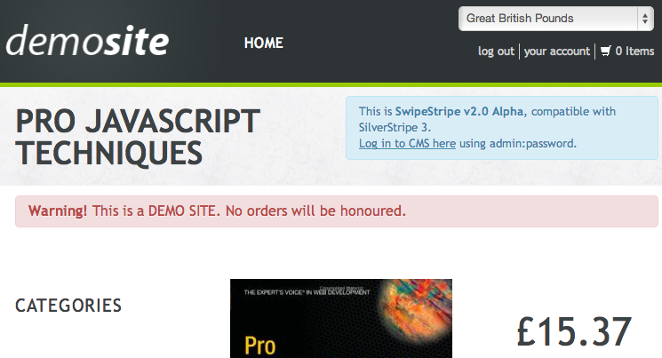

# Currency

Multiple currency is supported in SwipeStripe but SwipeStripe still processes **all** orders in a base currency. 

All orders are sent to the payment gateway using the base currency set for the shop.

## Base Currency

Using a base currency for all transactions..

* Helps vendors maintain their books as all orders are processed through a single currency. 
* Means that payment gateways that only support processing orders in a single currency for each account can be used.
* Helps maintain prices for products

### Setting the base currency 

A base currency **must** be set for every shop, it can be set in the Shop->Settings->Base Currency section.

Base currency has 2 components:

* 3 letter [ISO 4217 code](http://en.wikipedia.org/wiki/ISO_4217#Active_codes)
* symbol e.g: $ or £ or ¥

The 3 letter code is saved for every product, variation, order, item and item option to make it clear what currency each entity uses.

The Symbol is used to display the prices on the website e.g:  
$199.99 or £24.95

More instructions on [settings base currency here](/dev/docs/swipestripe/en/Basics/Settings#base-currency).

## Multiple Currencies

Additional to the base currency other currencies can be created, these are used to convert prices in order to display them to the customer only. The converted prices are not used to process any orders, meaning a converted price is not sent to the payment gateway.

### Setting exchange rates

Exchange rates can be managed from the shop settings area. Each excahnge rate has a title, a rate and the currency symbol you would like to use when displaying the currency. 

The rate is the multiplier used when converting prices in the base currency to prices in another currency. 

You must always have an exchange rate set for the base currency with a rate of 1.0. This ensures the base currency can be chosen from the currency select field.

### Changing currencies

Different currencies can be selected by your customers on the frontend.

Use case:

1. Customer lands on site, prices are in the base currency for the site: NZD
2. Customer changes currency to USD
3. Prices for products are now displayed to the customer in USD (they are being converted from NZD -> USD on the fly)
4. Customer adds products to cart, goes to checkout - all prices are still displayed as USD
5. Customer processes order and is redirected to a payment gateway to make payment, the amount at the payment gateway is in NZD - the base currency for the site
6. Customer completes payment, is redirected back to site to view the invoice of their order, the invoice is in USD (their chosen currency). 

### Adding currency form to templates

To include the currency select field on your templates simply use:

:::php
	$CurrencyForm

When a currency is selected in the dropdown field, javascript will submit the form which will set the currency in the session for the customer:

:::php
	Session::set('SWS.Currency', $currency);
	

