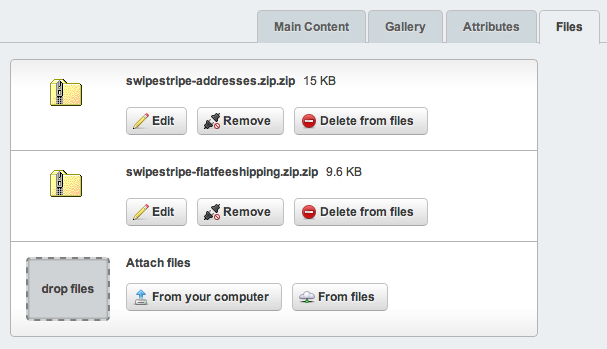
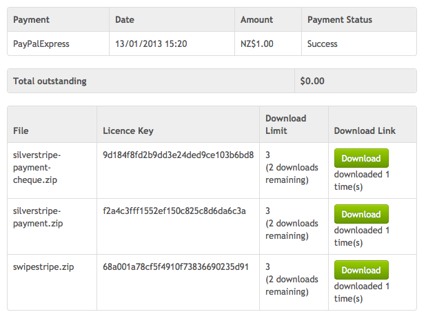

# Downloadable

The downloadable extension allows you to assign files to products in order to sell digital goods such as ebooks or music. 

## Setting up

You can either drag and drop files or select existing files when attaching them to products. 

If you attach existing files to products you can use mechanisms such as version control to update files easily.

## Delivery

When an order is placed and successfully paid for the files for the products will be copied to an unaccessible location in your assets directory. 

When a customer downloads a file the download attempt is recorded and the file is copied again to an accessible location in your assets directory, this is where it will stay for at least 24 hrs to give the customer a reasonable window of opportunity to complete the download. The file can be downloaded up to 3 times, this is the default download limit.

Unique licence keys will be generated for you for each downloadable file.

## Configuring

You can change the download limit, download window and download folders easily from your _config.php.

:::php
	Downloadable_Item::$downloadLimit = 3;
	Downloadable_Item::$downloadWindow = '1 day';
	Downloadable_Item::$downloadFolder = 'Downloads';
	Downloadable_Item::$productFolder = 'Products';
	Downloadable_Item::$uploadFolder = 'Uploads';
