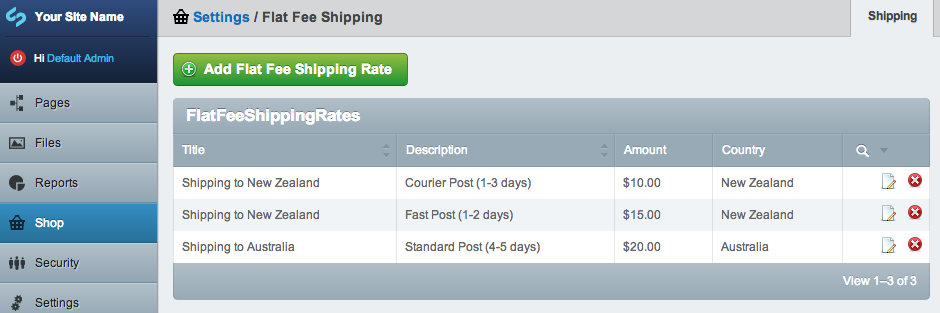
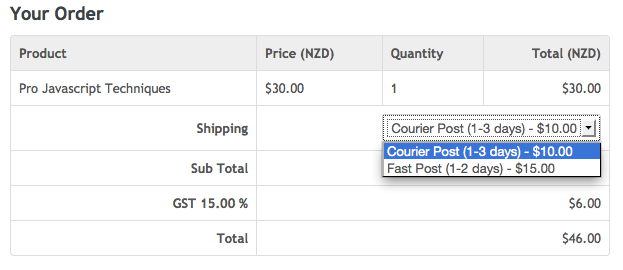

# Shipping

## Creating shipping rates

Flat fee shipping rates can be set for different countries using the "Flat Fee Shipping" extension.

## Choosing a shipping option

If multiple rates are set for a country they will appear as a dropdown field on the checkout form for the customer to choose.

Shipping rates are applied before the sub total, so modifiers that come *after* the sub total (like tax and coupon discounts) will be applied to shipping costs also.

Shipping relies on the "Addresses" extension because the customers shipping address country is used to select available shipping rates.

