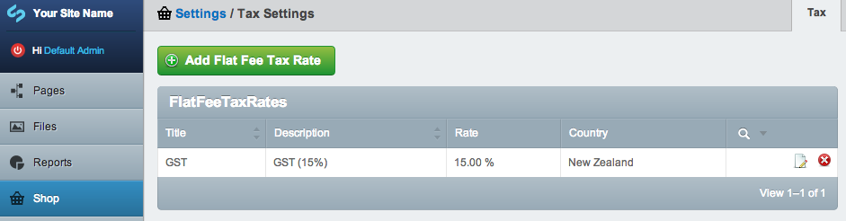
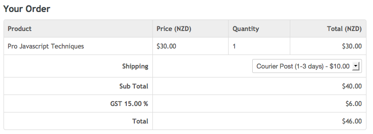

# Tax

## Creating tax rates

The tax extension supports setting different tax rates per country.

Usually you will be registered to apply tax for a certain country, for instance you might be registered to apply GST in New Zealand - in these cases you will just have a single tax rate (GST 15%) for a single country (NZ).

## Applying tax

The tax rate is applied to the sub total of an order at checkout. The rate is chosen based on the shipping country destination of the order.

Tax relies on the "Addresses" extension because the customers shipping address country is used to select the applicable tax rate.

## Product prices

Because tax is applied to the sub total of the order, line items such as shipping will have the tax rate applied also. This also means that all product prices and shipping rates should be **excluding tax**. 

If you are shipping internationally you will likely want to represent your product prices excluding tax anyway given that tax is not always applicable when orders are shipped to foreign countries.

If you want to include tax in your product prices the best approach is to not install the tax module but instead alter the includes/Order.ss template so that the tax component is retrospectively calculated and displayed seperately for every order.

